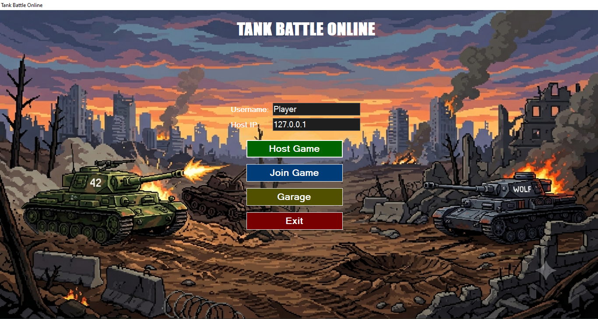
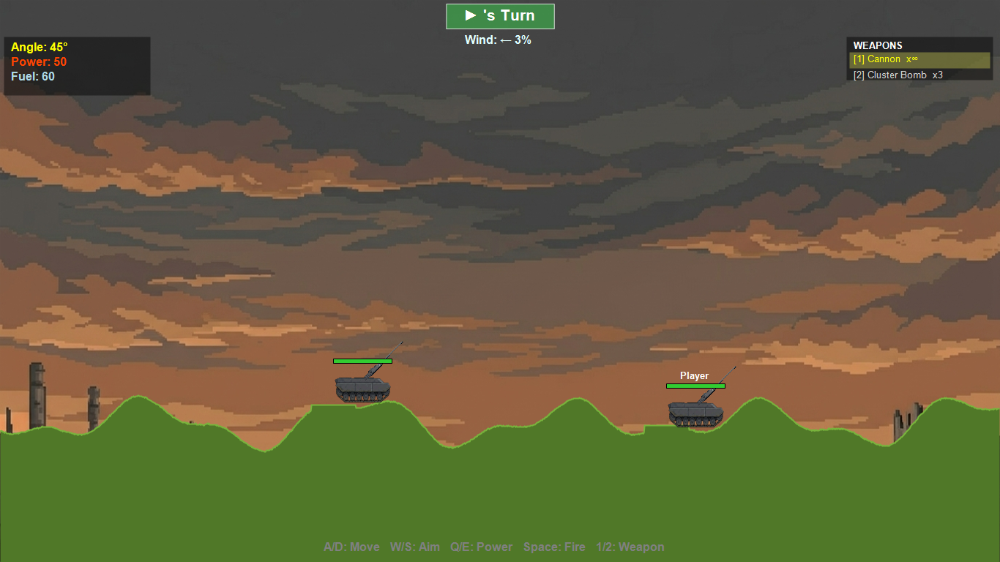
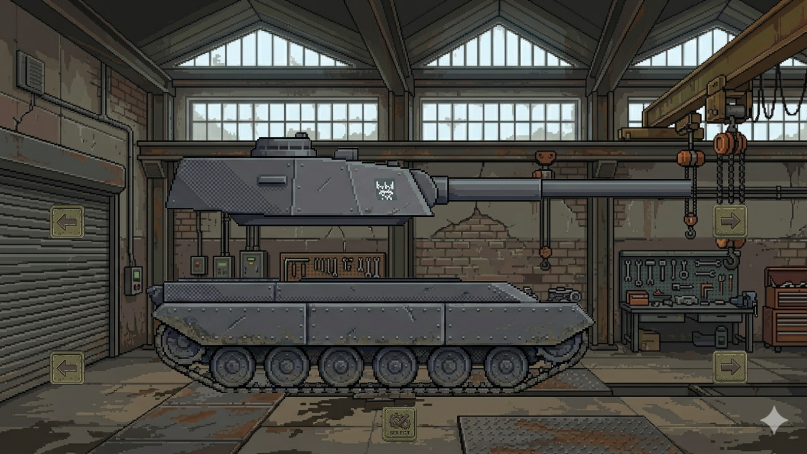

# 🎮 WinForm Multiplayer Tank Game

A 2D turn-based artillery shooter built in **C# Windows Forms**, inspired by classics like *Scorched Earth* and *Tank Stars*. Two players battle on destructible terrain, adjusting aim angle and fire power to eliminate the opponent. Features real-time online multiplayer over TCP, supply crate drops, and trajectory preview.

---

## 📸 Screenshots


| Main Menu | Gameplay |
|-----------|----------|
|  |  |

| Garage / Tank Selection | 
|-------------------------|
|  | 

---

## 🚀 Features

- 🌐 **Online Multiplayer** via TCP (Host / Join)
- 💥 **Destructible terrain** — craters form on impact
- 🪂 **Supply crate drops** — health and ammo crates fall from sky
- 🎯 **Trajectory preview** — dotted line shows projected path
- 💨 **Wind system** — affects projectile path each round
- 🛡️ **Tank customization** — choose body and cannon in garage
- 🧱 **Layered OOP architecture** — Model / BL / DAL / UI

---

## 🕹️ Controls

| Key | Action |
|-----|--------|
| `A` / `D` | Move tank left / right |
| `W` / `S` | Aim barrel up / down |
| `Q` / `E` | Decrease / Increase fire power |
| `Space` | Fire |
| `1` | Switch to Cannon |
| `2` | Switch to Cluster Bomb |
| `R` | Restart (after game over) |
| `Esc` | Exit to main menu |

---

## 🌐 How to Play Multiplayer (Online via Hamachi)

Hamachi creates a virtual LAN so both players can connect from anywhere — works on university networks, EduRoam, and home WiFi without port forwarding.

### Step 1 — Both players install Hamachi

Download from: **https://vpn.net**

Install and create a free account.

### Step 2 — Host creates a Hamachi network

1. Open Hamachi
2. Click **Network** → **Create a new network**
3. Enter a **Network ID** (e.g. `tankwars-umar`) and a **Password** (e.g. `1234`)
4. Click **Create**
5. Your **Hamachi IP** is shown at the top of the Hamachi window — it looks like `25.x.x.x`

### Step 3 — Guest joins the Hamachi network

1. Open Hamachi
2. Click **Network** → **Join an existing network**
3. Enter the same **Network ID** and **Password** the host shared
4. Click **Join**

### Step 4 — Host starts the game

1. Launch `OOP_GAME.exe`
2. Enter your username
3. Leave IP field as default
4. Click **Host Game**
5. Wait for guest to connect — screen will show "Waiting for player..."

### Step 5 — Guest joins the game

1. Launch `OOP_GAME.exe`
2. Enter your username
3. In the IP field enter the **host's Hamachi IP** (e.g. `25.12.34.56`)
4. Click **Join Game**

Both players will transition to the garage screen to select tank appearance, then the game starts automatically.

---

## 🧪 Testing Multiplayer on One PC (Localhost)

No Hamachi needed. Run two instances of the game on the same machine:

1. Build the project in Visual Studio (**Release** mode)
2. Go to `bin/Release/` folder
3. Double-click `OOP_GAME.exe` **twice**
4. **Instance 1:** Enter username → Click **Host Game**
5. **Instance 2:** Enter username → IP: `127.0.0.1` → Click **Join Game**

---

## 🔧 Installation & Running

### Requirements

- Windows 10 / 11
- .NET Framework 4.7.2 or higher
- No additional packages required

### Run from source

1. Clone the repo:
```bash
git clone https://github.com/mUmarSaga/WinForm_MultiplayerTankGame.git
```
2. Open `OOP_GAME.sln` in Visual Studio
3. Press `F5` to build and run

### Run compiled exe

1. Go to `bin/Release/`
2. Copy the entire folder to your PC
3. Double-click `OOP_GAME.exe`

---

## 🏗️ Project Architecture

```
OOP_GAME/
├── Model/               # Pure data classes
│   ├── Tank.cs          # Abstract base
│   ├── HeavyTank.cs
│   ├── LightTank.cs
│   ├── AiTank.cs
│   ├── Projectile.cs    # Abstract base
│   ├── Bullet.cs
│   ├── Missile.cs
│   ├── ClusterBomb.cs
│   ├── Weapon.cs        # Abstract base
│   ├── Cannon.cs
│   ├── ClusterBombWeapon.cs
│   ├── SupplyCrate.cs
│   └── CurrentSession.cs
│
├── BL/                  # Game logic
│   ├── GameEngine.cs    # Main game loop, turn system
│   ├── PhysicsEngine.cs # Gravity, collision, damage
│   ├── TerrainManager.cs# Terrain generation, craters
│   └── NetworkManager.cs# TCP multiplayer networking
│
├── DAL/                 # Data access
│   └── GameSaveDAL.cs   # Save / load game state
│
└── UI/                  # Windows Forms
    ├── MenuForm.cs      # Main menu, host/join
    ├── Garage.cs        # Tank selection screen
    └── GameForm.cs      # Main game screen
```

### OOP Concepts Demonstrated

| Concept | Where |
|---------|-------|
| **Inheritance** | `Tank → HeavyTank, LightTank, AiTank` |
| **Abstraction** | `Tank`, `Projectile`, `Weapon` are abstract |
| **Polymorphism** | `TakeDamage()`, `Fire()`, `CreateProjectile()` overridden |
| **Encapsulation** | Each class owns its own data and exposes only what's needed |
| **Singleton** | `NetworkManager.Instance`, `CurrentSession.Instance` |
| **Events** | `GameEngine` fires events, UI subscribes |

---

## 👨‍💻 Developer

**Muhammad Umar**
BS Computer Science — UET Lahore (2025–2029)
GitHub: [@mUmarSaga](https://github.com/mUmarSaga)

---

## 📄 License

This project is for educational purposes — BS OOP Course, UET Lahore.
